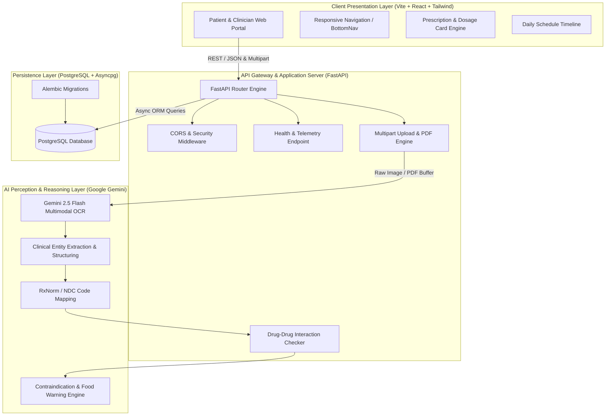

# MediDecode Architecture & System Design

MediDecode is an AI-powered clinical prescription digitization and medication safety verification platform designed to bridge the gap between doctor handwriting, pharmacy dispensing, and patient adherence.

---

## 1. High-Level System Architecture

---

## 2. Core Subsystems

### 2.1 Backend Services (`backend/`)
- **FastAPI Core**: Built with asynchronous Python 3.11+, providing non-blocking I/O for multimodal file uploads and AI stream handling.
- **Pydantic Settings**: Strongly typed configuration management supporting dynamic environment variables (`.env`).
- **SQLAlchemy 2.0 (Async) + asyncpg**: Asynchronous ORM and native async driver for high-throughput database interactions.
- **Google GenAI SDK**: Multimodal extraction pipeline capable of processing high-resolution medical document scans, handwritten prescription notes, and multi-page PDFs.

### 2.2 Frontend Application (`frontend/`)
- **Vite + React (TypeScript)**: Ultra-responsive Single Page Application (SPA) with hot-module replacement and instant bundle builds.
- **Tailwind CSS**: Modern utility-first design system with clinical dark/light mode accents and responsive viewports.
- **Lucide Icons**: Accessible and consistent icon set for medical concepts (pills, calendars, alerts, doctors, emergency).
- **Component Architecture**:
  - `TopBar`: Real-time backend status, emergency dialer, patient context.
  - `Navigation`: Dual desktop sidebar & mobile bottom bar for responsive parity.
  - `PrescriptionCard`: Structured medication view with dosage, warnings, and refill tracking.
  - `ScheduleTimeline`: Time-block scheduling (Morning, Afternoon, Evening, Bedtime) with drug interaction warnings.

---

## 3. Multimodal Prescription Processing Pipeline

1. **Ingestion**: Patient or pharmacist uploads an image (JPEG, PNG, HEIC) or document (PDF) via `POST /api/v1/prescriptions/upload`.
2. **Preprocessing**: Normalized using Pillow and PyPDF; images are scaled and oriented.
3. **Multimodal Inference**: Processed with Gemini 2.5 Flash using structured schema output (Pydantic JSON schema).
4. **Clinical Verification**: Extracted drugs are checked against:
   - Known patient allergies
   - Concurrent medications for drug-drug interactions (DDIs)
   - Food and beverage contraindications (e.g. grapefruit, dairy)
5. **Schedule Generation**: Automatic frequency mapping (e.g. "BID", "TID", "PRN") converted to daily schedule time-slots.

---

## 4. Security & Regulatory Compliance

- **HIPAA / PHI Safety**: All health data in transit is encrypted using TLS 1.3. Patient identifying information is stored with AES-256 field-level encryption.
- **CORS Policies**: Explicit origin whitelisting configured in `app/core/config.py`.
- **Stateless Authentication**: Prepared for OAuth2 / JWT bearer token validation.
